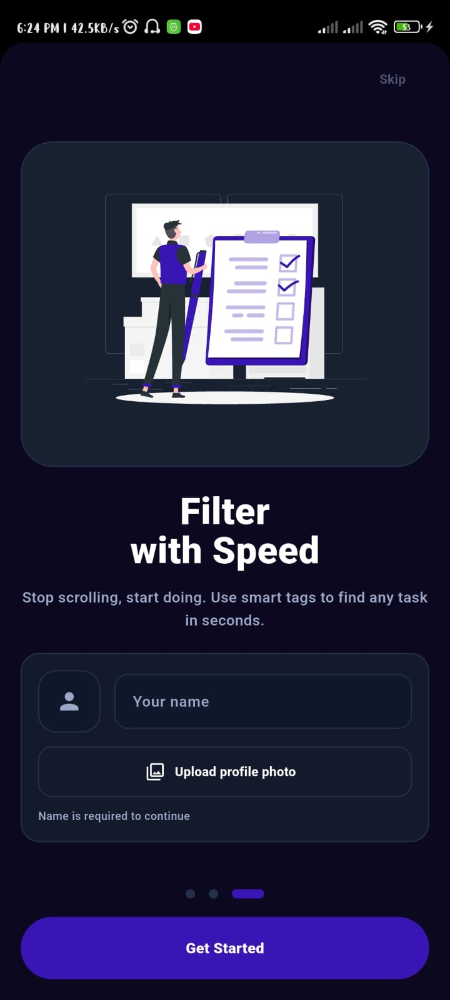
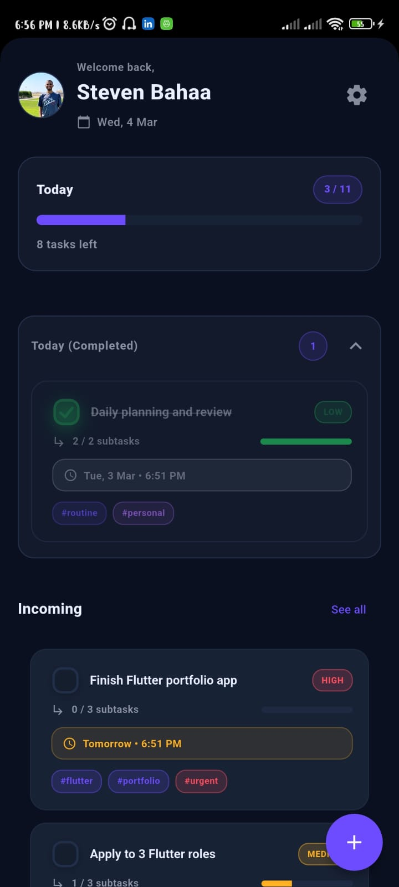
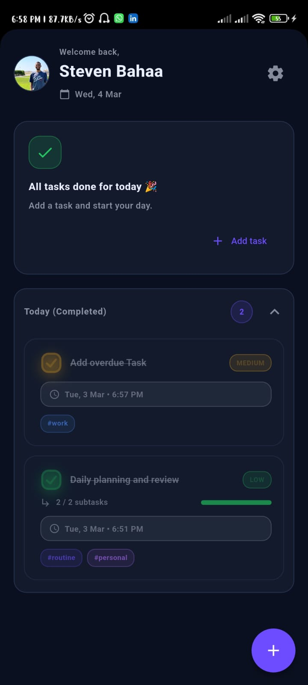
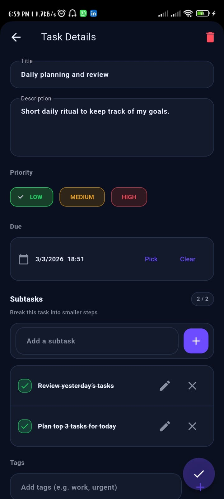
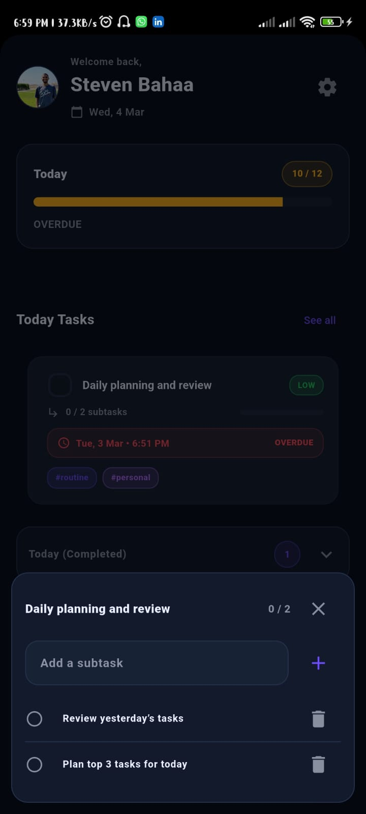
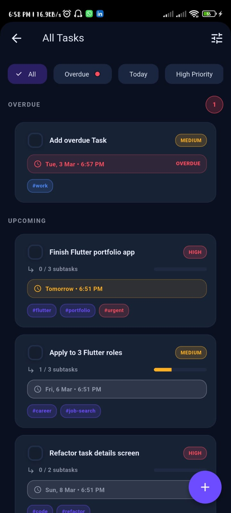
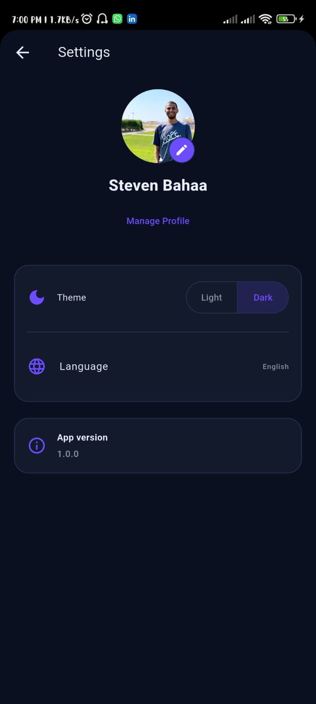
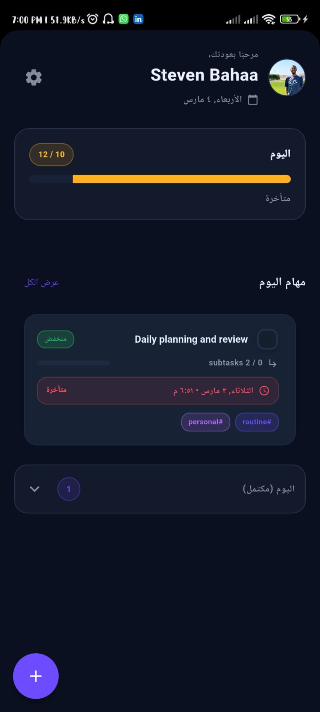

# 🚀 Todo List – Flutter Productivity App

A modern, production-ready productivity app built with **Flutter**.  
Designed to help users plan their day, manage subtasks, and stay focused through a clean and scalable mobile architecture.

This project demonstrates real-world Flutter practices including feature-based structure, Cubit state management, offline-first storage, and polished UI/UX.

---

## 📱 App Preview

### 🧭 Onboarding & Today Dashboard

<p>
  
  &nbsp;&nbsp;&nbsp;
  
</p>

### ✅ All Done & Task Details

<p>
  
  &nbsp;&nbsp;&nbsp;
  
</p>

### 🧩 Subtasks & All Tasks

<p>
  
  &nbsp;&nbsp;&nbsp;
  
</p>

### ⚙️ Settings & 🌍 Localization (Arabic)

<p>
  
  &nbsp;&nbsp;&nbsp;
  
</p>

---

## ✨ Key Features

### 🌤 Today Dashboard
- Animated progress indicator
- Smart completion tracking
- Urgent tasks section
- Expandable "Completed Today" section
- Upcoming tasks preview
- Overdue highlighting
- Smooth completion animations

---

### 📝 Advanced Task Management

Each task includes:

- Title & description
- Priority levels (Low / Medium / High)
- Optional due date
- Custom tags (e.g. `#flutter`, `#work`, `#urgent`)
- Editable subtasks:
  - Add
  - Rename
  - Toggle
  - Delete

---

### 🧠 Smart Completion Logic

Tasks containing subtasks are marked as completed **only when all subtasks are completed**.

The Today dashboard progress indicator reflects this smart logic instead of relying on a simple checkbox.

---

### 👤 Onboarding Flow

- Collects user name and profile image
- Stores user data locally
- Automatically skips onboarding after first launch

---

### ⚙️ Settings

- Profile management
- Theme selection (Light / Dark)
- Language selection (English / Arabic)
- Full RTL support
- App version section

---

## 🧱 Technical Architecture

### 🔹 Tech Stack

- **Flutter**
- **flutter_bloc (Cubit)**
- **Hive (Local storage)**
- **Feature-based architecture**
- **Flutter gen-l10n localization**

---

## 🏗 Project Structure

```bash
lib/
  app/                    # App shell & routing
  core/                   # Theme, widgets, utilities
  data/
    local/                # Hive initialization & adapters
    models/               # TaskModel, SubTaskModel, enums
    repositories/         # Data abstraction layer
  features/
    onboarding/
    today/
    tasks/
    settings/
  l10n/                   # Localization files (en/ar)